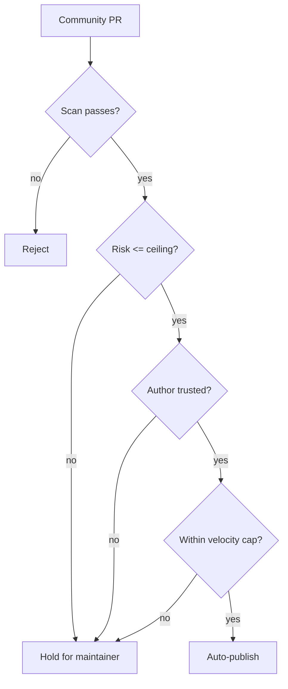

# Community intake policy

The `skills/community/**` namespace is **open**: anyone on the team can add a
skill there, and it publishes on the automated scan alone. No human signs off on
community content, so its catalog trust label is **Auto-checked**, never
"Reviewed".

Because nobody reviews community content by hand, the automated intake gate is
the only thing standing between the marketplace and a bad day. This document
explains, in plain terms, what that gate does and why.

## The risk we are defending against

> A brand-new account, or a real account that has been taken over, opens a burst
> of pull requests that add malicious or junk skills to the community namespace
> faster than anyone notices.

One clever skill slipping through is bad. A *flood* of them is worse, because it
buries the signal and wastes reviewer attention. The gate is designed to make
that flood expensive and slow, without adding friction for trusted contributors
doing ordinary work.

## Defence in depth: five independent layers

Each layer catches something the others miss. A submission has to get past
**all** of them to auto-publish.

| # | Layer | What it stops | Where it lives |
|---|-------|---------------|----------------|
| 1 | **Fork gate** | Untrusted code from forks; CI never runs on or grants a token to a fork PR. | `.github/workflows/pr.yml` |
| 2 | **Deterministic scan** | Secrets, hidden Unicode, undeclared network/scripts, blocked file types, tampering. Blocking findings stop publication outright. | `scripts/marketplace.py` (`scan_package`) |
| 3 | **Capability risk band** | Over-broad permissions. Wildcard capabilities (`*`), secrets combined with commands or network, or `RESTRICTED` data all raise the band to **high**, which cannot auto-publish. | `capability_risk()` |
| 4 | **Author-trust gate** | New or compromised accounts. The author must have belonged to the org long enough **and** be a verified org member. | `community-intake.yml` + config |
| 5 | **Velocity cap** | Bursts. One author may only have a few community submissions open at once. Exceeding the cap holds the extra ones for a human. | `community-intake.yml` + config |

## The decision, in one sentence

A community submission **auto-publishes** only when the scan passes **and** its
capability risk is at or below the configured ceiling **and** the author clears
the tenure and org-membership bar **and** the author is within the velocity cap.
If any one of those is not true, the submission is **held for a maintainer**. If
the scan finds a blocking problem, the submission is **rejected**.



The decision itself is a pure, tested function
(`intake_decision` in `scripts/marketplace.py`). It **fails safe**: if the
workflow cannot resolve the author's tenure or velocity, the submission is held,
never auto-published.

## The knobs (config/marketplace.yaml)

```yaml
community-intake:
  min-account-age-days: 30          # account must be at least this old
  require-verified-org-membership: true
  max-open-submissions-per-author: 3
  max-new-packages-per-window: 5
  window-days: 7
  auto-publish-risk-ceiling: elevated  # low | elevated | high
```

Raise the thresholds to loosen the gate, lower them to tighten it. The default
ceiling is `elevated`: everyday skills that run commands or reach the network can
auto-publish for a trusted author, but anything that declares a wildcard
capability (risk `high`) always waits for a person.

## Honest limitations

- **Account age is a proxy.** The public GitHub API exposes when an *account* was
  created, not when it joined the org, so tenure is measured from account
  creation. A dedicated org-membership timestamp would be stronger and needs a
  token with org read scope.
- **Org membership and velocity need a token.** The `community-intake` workflow
  must run with a token that can read org membership and search the author's open
  pull requests. Without it, every community submission is held (fail-safe), which
  is safe but noisy.
- **This gate governs new submissions only.** Skills already in the tree are shown
  with their `Auto-checked` label and their capability-risk chip so a reader can
  judge them directly; the gate does not retroactively remove them.

## Tradeoffs and alternatives considered

- **Human-review everything (rejected):** highest assurance, but it does not scale
  to an open community namespace and defeats the "put anything here" goal.
- **Scan-only, no author gate (rejected):** lowest friction, but leaves the flood
  scenario wide open — a scan cannot tell a trusted author from a throwaway account.
- **Author gate + risk ceiling + velocity (chosen):** trusted contributors move
  fast on ordinary skills; risky or high-volume or untrusted activity slows down to
  human speed. This matches the open-namespace intent while removing the single
  point of failure.
